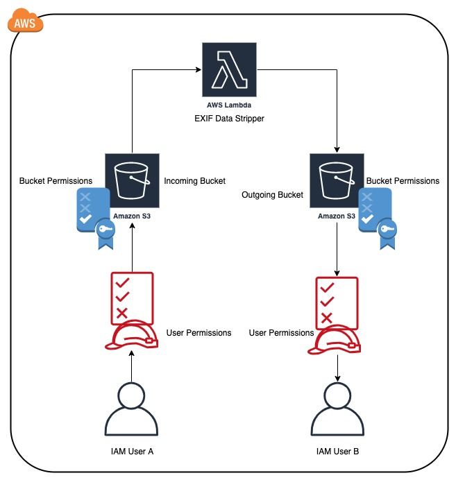

### USAGE
1. Read the main.tf terraform file

2. Run "terraform init" command.

3. After that run "terraform plan"

4. If satisfied with plan output then run "terraform apply".
Type "yes" for the confirmation.

5. Then upload a file to bucket a and test.

### ARCHITECTURE

